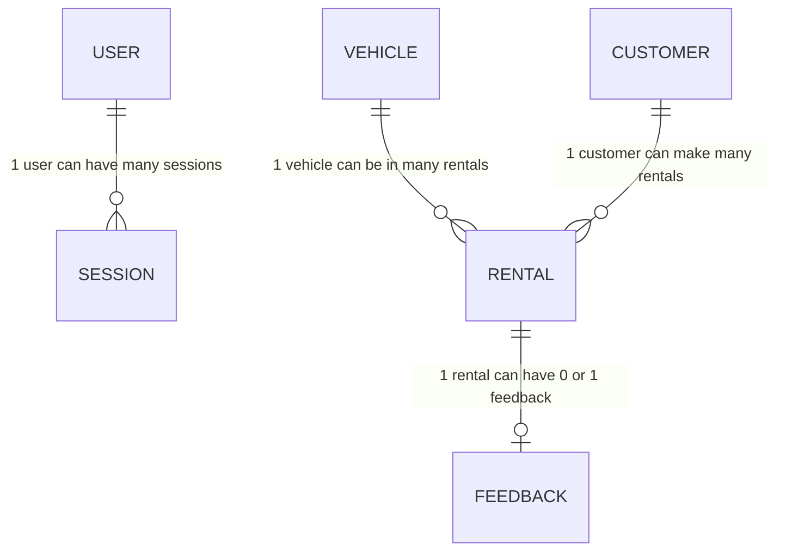
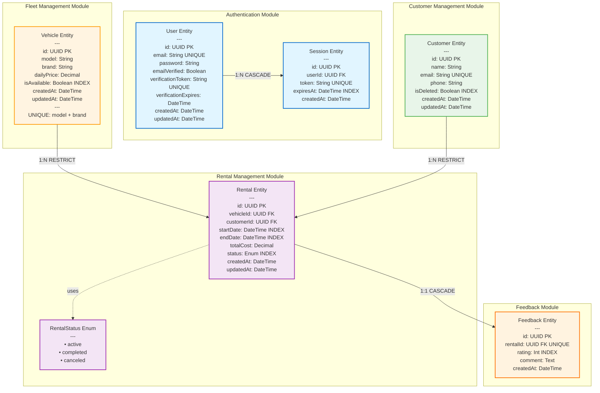
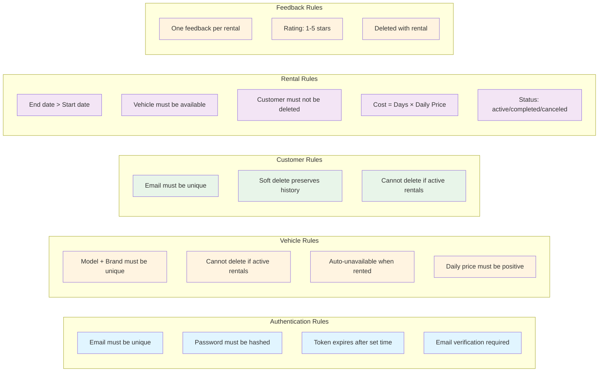
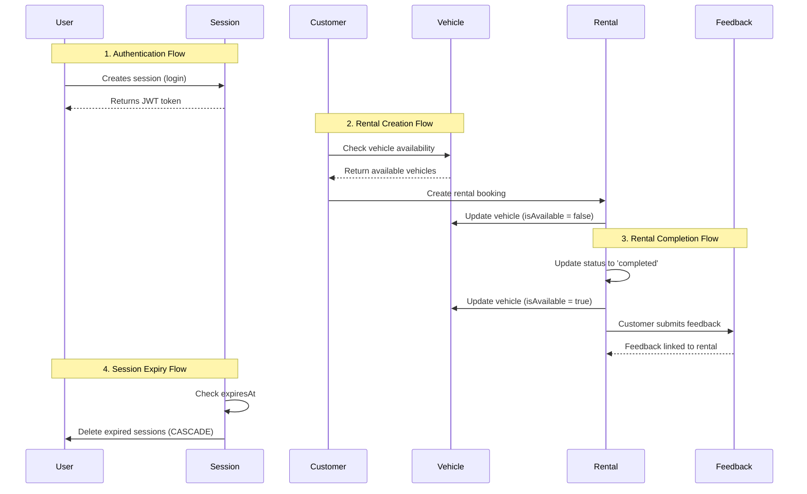

# Database Diagrams - Car Rental Management System

## 1. ERD (Entity Relationship Diagram) - Basic

```mermaid
erDiagram
    USER ||--o{ SESSION : "has"
    VEHICLE ||--o{ RENTAL : "rented_in"
    CUSTOMER ||--o{ RENTAL : "makes"
    RENTAL ||--o| FEEDBACK : "receives"

    USER {
        uuid id PK
        string email UK
        string password
        boolean emailVerified
        string verificationToken UK
        datetime verificationExpires
        datetime createdAt
        datetime updatedAt
    }

    SESSION {
        uuid id PK
        uuid userId FK
        string token UK
        datetime expiresAt
        datetime createdAt
    }

    VEHICLE {
        uuid id PK
        string model
        string brand
        decimal dailyPrice
        boolean isAvailable
        datetime createdAt
        datetime updatedAt
    }

    CUSTOMER {
        uuid id PK
        string name
        string email UK
        string phone
        boolean isDeleted
        datetime createdAt
        datetime updatedAt
    }

    RENTAL {
        uuid id PK
        uuid vehicleId FK
        uuid customerId FK
        datetime startDate
        datetime endDate
        decimal totalCost
        enum status
        datetime createdAt
        datetime updatedAt
    }

    FEEDBACK {
        uuid id PK
        uuid rentalId FK-UK
        int rating
        text comment
        datetime createdAt
    }
```

## 2. EERD (Enhanced Entity Relationship Diagram) - Detailed

```mermaid
erDiagram
    USER ||--o{ SESSION : "authenticates_with"
    VEHICLE ||--o{ RENTAL : "is_rented_in"
    CUSTOMER ||--o{ RENTAL : "creates"
    RENTAL ||--|| FEEDBACK : "may_have"

    USER {
        uuid id PK "Primary Key - UUID"
        string email UK "Unique - User email"
        string password "Hashed password"
        boolean emailVerified "Default: false"
        string verificationToken UK "Unique - Email verification"
        datetime verificationExpires "Token expiry"
        datetime createdAt "Auto-generated"
        datetime updatedAt "Auto-updated"
    }

    SESSION {
        uuid id PK "Primary Key - UUID"
        uuid userId FK "Foreign Key -> User.id"
        string token UK "Unique - JWT token (max 500 chars)"
        datetime expiresAt "Session expiration - Indexed"
        datetime createdAt "Auto-generated"
    }

    VEHICLE {
        uuid id PK "Primary Key - UUID"
        string model "Vehicle model"
        string brand "Vehicle brand"
        decimal dailyPrice "Decimal(10,2) - Price per day"
        boolean isAvailable "Default: true - Indexed"
        datetime createdAt "Auto-generated"
        datetime updatedAt "Auto-updated"
    }

    CUSTOMER {
        uuid id PK "Primary Key - UUID"
        string name "Customer full name"
        string email UK "Unique - Customer email"
        string phone "Contact number"
        boolean isDeleted "Soft delete - Default: false - Indexed"
        datetime createdAt "Auto-generated"
        datetime updatedAt "Auto-updated"
    }

    RENTAL {
        uuid id PK "Primary Key - UUID"
        uuid vehicleId FK "Foreign Key -> Vehicle.id - Restrict"
        uuid customerId FK "Foreign Key -> Customer.id - Restrict"
        datetime startDate "Rental start - Indexed"
        datetime endDate "Rental end - Indexed"
        decimal totalCost "Decimal(10,2) - Total rental cost"
        enum status "active|completed|canceled - Default: active - Indexed"
        datetime createdAt "Auto-generated"
        datetime updatedAt "Auto-updated"
    }

    FEEDBACK {
        uuid id PK "Primary Key - UUID"
        uuid rentalId FK-UK "Foreign Key & Unique -> Rental.id - Cascade"
        int rating "1-5 stars - Indexed"
        text comment "Optional - Customer feedback"
        datetime createdAt "Auto-generated"
    }
```

## 3. Detailed Cardinality Diagram



## 4. Complete Database Schema with Indexes



## 5. Relationship Details

### Relationships Summary:

| From Entity | To Entity | Relationship Type | Cardinality | Delete Action |
|------------|-----------|-------------------|-------------|---------------|
| User | Session | One-to-Many | 1:N | CASCADE |
| Vehicle | Rental | One-to-Many | 1:N | RESTRICT |
| Customer | Rental | One-to-Many | 1:N | RESTRICT |
| Rental | Feedback | One-to-One | 1:0..1 | CASCADE |

### Constraints & Indexes:

#### User
- **Primary Key**: `id` (UUID)
- **Unique**: `email`, `verificationToken`
- **Indexes**: Default on PK and unique fields

#### Session
- **Primary Key**: `id` (UUID)
- **Foreign Key**: `userId` → User.id (CASCADE DELETE)
- **Unique**: `token`
- **Indexes**: `expiresAt`

#### Vehicle
- **Primary Key**: `id` (UUID)
- **Unique Composite**: (`model`, `brand`)
- **Indexes**: `isAvailable`

#### Customer
- **Primary Key**: `id` (UUID)
- **Unique**: `email`
- **Indexes**: `isDeleted`

#### Rental
- **Primary Key**: `id` (UUID)
- **Foreign Keys**:
  - `vehicleId` → Vehicle.id (RESTRICT DELETE)
  - `customerId` → Customer.id (RESTRICT DELETE)
- **Indexes**: `(startDate, endDate)`, `status`
- **Enum**: `status` (active, completed, canceled)

#### Feedback
- **Primary Key**: `id` (UUID)
- **Foreign Key**: `rentalId` → Rental.id (CASCADE DELETE, UNIQUE)
- **Indexes**: `rating`

## 6. Business Rules Diagram



## 7. Data Flow Diagram



## How to Use These Diagrams:

### In GitHub/GitLab:
Just paste the mermaid code blocks into your `.md` files, and they will render automatically.

### In Overleaf/LaTeX:
Unfortunately, Overleaf doesn't natively support Mermaid. You'll need to:
1. Render these diagrams using [Mermaid Live Editor](https://mermaid.live)
2. Export as PNG/SVG
3. Include images in LaTeX using `\includegraphics{}`

### In Documentation Sites:
Most modern documentation platforms (Docusaurus, VitePress, MkDocs) support Mermaid natively.

### Online Rendering:
- Visit [Mermaid Live Editor](https://mermaid.live)
- Paste the code
- Export as PNG, SVG, or PDF
